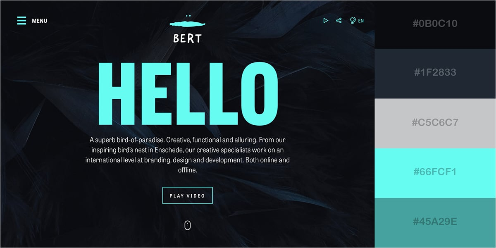

# Sistema de Diseño - David Medina Website

Documentación de las decisiones de diseño para el sitio web personal.

---

## Paleta de Colores

### Fuente de Inspiración


**Origen:** [Visme - 50 Gorgeous Color Schemes](https://visme.co/blog/website-color-schemes/)

### Colores Principales

| Nombre | Hex | RGB | Uso |
|--------|-----|-----|-----|
| **Negro Carbón** | `#0B0C10` | 11, 12, 16 | Fondo principal |
| **Gris Oscuro** | `#1F2833` | 31, 40, 51 | Secciones, cards, header |
| **Gris Plata** | `#C5C6C7` | 197, 198, 199 | Texto secundario |
| **Cyan Brillante** | `#66FCF1` | 102, 252, 241 | Accent principal, CTAs, highlights |
| **Cyan Oscuro** | `#45A29E` | 69, 162, 158 | Hover states, accent secundario |

### Colores de los 4 Frentes (mantenidos)

| Frente | Color | Hex |
|--------|-------|-----|
| Analítica Estratégica | Azul | `#2563eb` |
| IA con Propósito | Violeta | `#7c3aed` |
| Fe en Acción | Rojo | `#dc2626` |
| Transformación Ágil | Verde | `#059669` |

### Variables CSS

```css
:root {
  /* Fondos */
  --bg-primary: #0B0C10;
  --bg-secondary: #1F2833;

  /* Texto */
  --text-primary: #FFFFFF;
  --text-secondary: #C5C6C7;

  /* Accent */
  --accent-primary: #66FCF1;
  --accent-secondary: #45A29E;

  /* 4 Frentes */
  --frente-analitica: #2563eb;
  --frente-ia: #7c3aed;
  --frente-fe: #dc2626;
  --frente-agil: #059669;
}
```

### Justificación

- **Negro Carbón (#0B0C10):** Fondo oscuro profesional, reduce fatiga visual, estándar en dashboards de BI
- **Cyan (#66FCF1):** Color tech por excelencia, transmite innovación y datos
- **Contraste:** La combinación oscuro + cyan tiene excelente contraste y legibilidad

---

## Tipografía

### Fuente de Inspiración
**Origen:** [Digital Arcane - Font Pairings for Tech Websites 2024](https://digitalarcane.com/font-pairings-for-tech-websites-in-2024/)

### Combinación Seleccionada: Lato + Cousine

> "Lato is a sleek sans-serif typeface with a modern feel, while Cousine is a versatile monospaced typeface with excellent readability. This pairing creates a harmonious balance between sophistication and simplicity, making it an ideal font pair for tech websites that want to showcase their expertise without appearing overly formal."

### Fuentes

| Fuente | Tipo | Google Fonts | Uso |
|--------|------|--------------|-----|
| **Lato** | Sans-serif | [Link](https://fonts.google.com/specimen/Lato) | Títulos, subtítulos, cuerpo |
| **Cousine** | Monospace | [Link](https://fonts.google.com/specimen/Cousine) | Código, tags, estadísticas |

### Pesos de Lato

| Peso | Uso |
|------|-----|
| 300 (Light) | Texto grande decorativo |
| 400 (Regular) | Cuerpo de texto |
| 700 (Bold) | Títulos, énfasis |
| 900 (Black) | Hero titles |

### Implementación CSS

```css
/* Google Fonts Import */
@import url('https://fonts.googleapis.com/css2?family=Lato:wght@300;400;700;900&family=Cousine:wght@400;700&display=swap');

/* Aplicación */
body {
  font-family: 'Lato', sans-serif;
}

h1, h2, h3, h4, h5, h6 {
  font-family: 'Lato', sans-serif;
  font-weight: 700;
}

.hero-title {
  font-family: 'Lato', sans-serif;
  font-weight: 900;
}

code, .tag, .stat-number, .mono {
  font-family: 'Cousine', monospace;
}
```

### Justificación

- **Lato:** Elegante pero accesible, profesional sin ser corporativo rígido
- **Cousine:** Monospace legible, ideal para mostrar datos/código/métricas
- **Combinación:** Balance entre sofisticación y simplicidad técnica

---

## Aplicación por Sección

| Sección | Fondo | Texto | Accent |
|---------|-------|-------|--------|
| Header | `#1F2833` | `#FFFFFF` | `#66FCF1` |
| Hero | `#0B0C10` + imagen | `#FFFFFF` | `#66FCF1` |
| Expertise | `#0B0C10` | `#FFFFFF` / `#C5C6C7` | Colores de frentes |
| About | `#1F2833` | `#FFFFFF` | `#66FCF1` |
| Skills | `#0B0C10` | `#FFFFFF` | `#66FCF1` barras |
| Milestones | `#1F2833` | `#66FCF1` números | - |
| Contact | `#0B0C10` | `#FFFFFF` | `#66FCF1` botón |
| Footer | `#0B0C10` | `#C5C6C7` | `#45A29E` |

---

## Elementos UI

### Botones

```css
/* Botón primario */
.button-primary {
  background: #66FCF1;
  color: #0B0C10;
  font-family: 'Lato', sans-serif;
  font-weight: 700;
}

.button-primary:hover {
  background: #45A29E;
}

/* Botón secundario (outline) */
.button-secondary {
  background: transparent;
  border: 2px solid #66FCF1;
  color: #66FCF1;
}

.button-secondary:hover {
  background: rgba(102, 252, 241, 0.1);
}
```

### Tags/Badges

```css
.tag {
  font-family: 'Cousine', monospace;
  font-size: 11px;
  background: rgba(102, 252, 241, 0.1);
  border: 1px solid rgba(102, 252, 241, 0.3);
  color: #66FCF1;
}
```

### Links

```css
a {
  color: #66FCF1;
  transition: color 0.3s ease;
}

a:hover {
  color: #45A29E;
}
```

---

## Resumen de Cambios

### Antes (Template Seppo original)
- Fondo: Negro puro `#000000`
- Accent: Verde lima `#47ea4e`
- Fuente: Rubik

### Después (Nuevo diseño)
- Fondo: Negro carbón `#0B0C10` / Gris oscuro `#1F2833`
- Accent: Cyan `#66FCF1` / `#45A29E`
- Fuente: Lato + Cousine

---

## Referencias

- Paleta: https://visme.co/blog/website-color-schemes/
- Fuentes: https://digitalarcane.com/font-pairings-for-tech-websites-in-2024/
- Lato: https://fonts.google.com/specimen/Lato
- Cousine: https://fonts.google.com/specimen/Cousine

---

*Documentado: Diciembre 2024*
